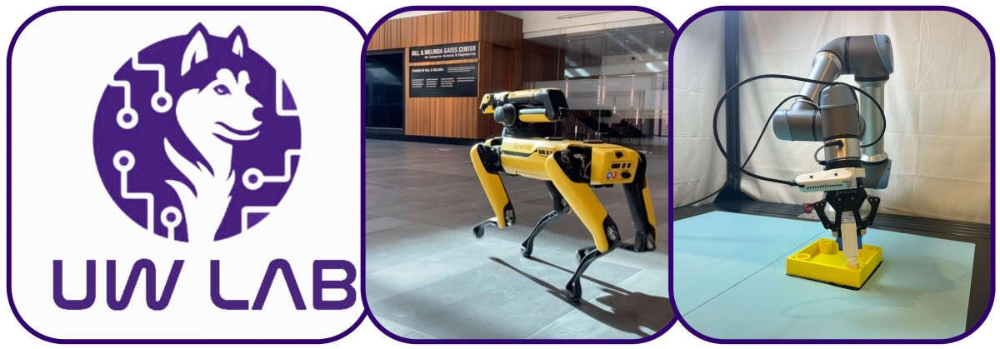

# UW Lab

## Overview

UW Lab builds upon the robust foundation established by Isaac Lab and NVIDIA Isaac Sim, expanding its framework to integrate a wider range of robotics algorithms, platforms, and environments. Rooted in principles of modularity, agility, openness, and a battery-included design inspired from IsaacLab, our framework is crafted to meet the evolving demands of modern robotics research.

In the short term, our mission is to consolidate and streamline robotics research into one cohesive ecosystem, empowering researchers and developers with a unified platform. Looking ahead, UW Lab envisions a future where artificial intelligence and robotics coalesce seamlessly with physical systems—bridging the gap between simulation and real-world application. By embedding the laws of physics at its core, our framework provides a realistic, adaptable platform for developing next-generation robotic systems.

At UW Lab, we believe that the development journey is as significant as the outcome. Our commitment to creating principled, flexible, and extensible structures supports an environment where innovation thrives and every experiment contributes to advancing the field of robotics. Join us as we push the boundaries of what's possible, transforming ideas into tangible, intelligent robotic solutions.

## Key Features

In addition to what IsaacLab provides, UW Lab brings:

- **Environments**: Cleaned Implementation of reputable environments in Manager-Based format
- **Sim to Real**: Providing robots and configuration that has been tested in Lab and deliver the Simulation Setup that can directly transfer to reals

## Installation

Follow the [installation guide](https://uw-lab.github.io/UWLab/main/source/setup/installation/index.html).

## Getting Started

- **Train Your First Policy** — Train an ant to run in minutes → [Quickstart](https://uw-lab.github.io/UWLab/main/source/setup/installation/pip_installation.html#train-a-robot)
- **OmniReset** — RL for manipulation without reward engineering or demos → [Quickstart](https://uw-lab.github.io/UWLab/main/source/publications/omnireset/index.html#quick-start)

See [all available environments](https://uw-lab.github.io/UWLab/main/source/overview/uw_environments.html) and [full documentation](https://uw-lab.github.io/UWLab) for details.

## Support

* Please use GitHub [Discussions](https://github.com/uw-lab/UWLab/discussions) for discussing ideas, asking questions, and requests for new features.
* Github [Issues](https://github.com/uw-lab/UWLab/issues) should only be used to track executable pieces of work with a definite scope and a clear deliverable. These can be fixing bugs, documentation issues, new features, or general updates.

## License

UW Lab is released under [BSD-3 License](LICENSE)
The Isaac Lab framework is released under [BSD-3 License](LICENSE).
